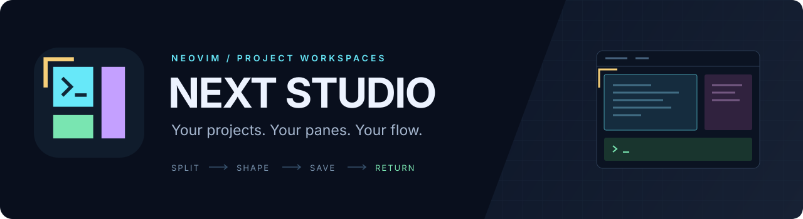
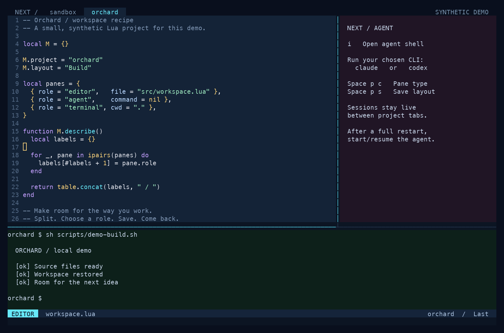
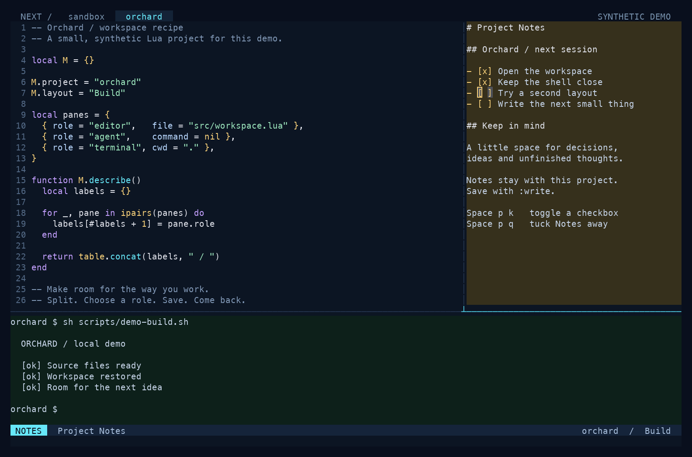
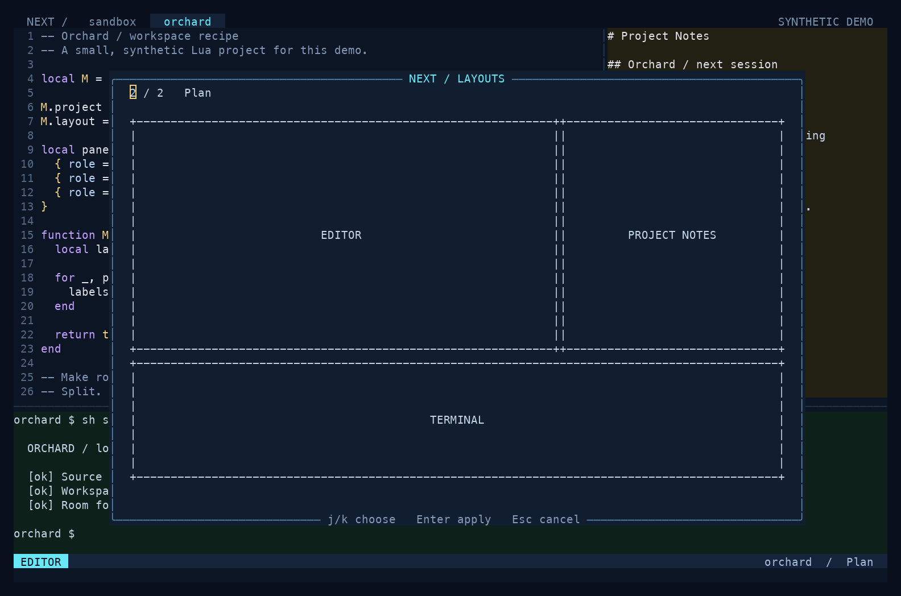
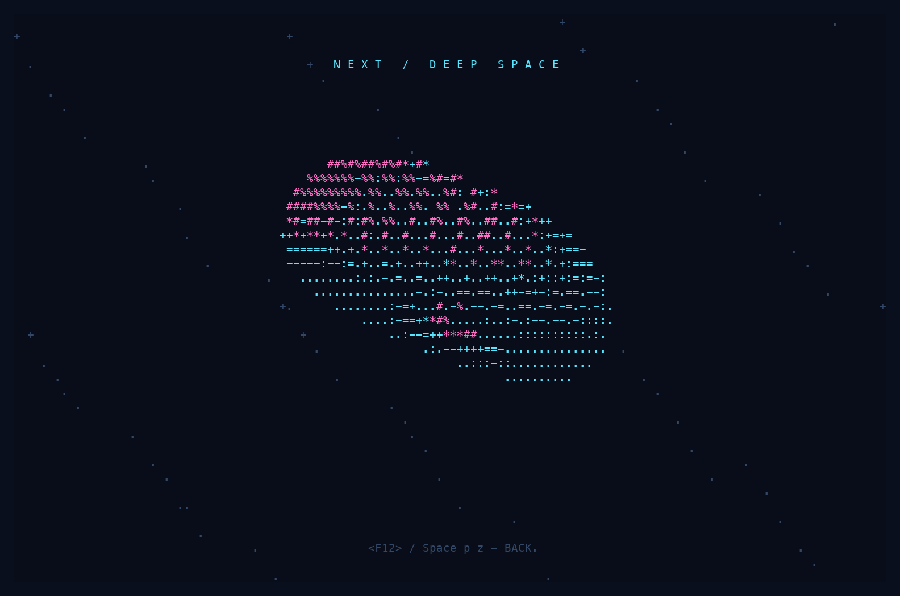

<p align="center">
  
</p>

<p align="center">
  <strong>Keyboard-driven project workspaces for Neovim.</strong><br>
  Keep your editor, agent shell, terminal and notes together. Save the arrangement. Come back to it.
</p>

<p align="center">
  <a href="#install">Install</a> ·
  <a href="#in-action">In action</a> ·
  <a href="#shortcuts">Shortcuts</a> ·
  <a href="#configuration">Configure</a> ·
  <a href="doc/next-studio.txt">Reference</a>
</p>

<p align="center">
  <code>Neovim 0.12+</code> &nbsp; <code>Lua</code> &nbsp;
  <code>No required plugins</code> &nbsp; <a href="LICENSE">MIT</a>
</p>



<p align="center"><sub>Actual Neovim, synthetic project. The demo theme and bars are custom; pane colors and workspace controls come from Studio.</sub></p>

## A workspace that fits the work

| | |
| --- | --- |
| **One project, one tab**<br>Choose a project or open Neovim inside its folder. Switch without losing live buffers and shells. | **Build your own layout**<br>Split right or below, choose a role, then resize, swap or zoom. Undo the arrangement when it feels wrong. |
| **Save a place to return to**<br>Keep named layouts per project and choose them with an ASCII preview. | **Notes within reach**<br>Keep Markdown notes and checkboxes beside the code, saved outside the project checkout. |
| **An agent's place at the table**<br>A local shell for the CLI you choose. Start it yourself; keep it beside your editor. | **One key to cover the screen**<br>F12 brings up an animated ASCII scene. F12 brings your workspace back. |

Studio works with your existing file manager, colorscheme, statusline and dashboard.
The core has **no required Neovim plugins**. If you already use Snacks, Studio can
use its project and input pickers. File navigation stays with the tools you use.

## Install

With **lazy.nvim / LazyVim**, add this spec to your plugin configuration:

```lua
return {
  {
    "iMilad/next-studio.nvim",
    main = "next_studio",
    lazy = false,
    opts = {
      auto_open = true,
      project_roots = { "~/workspace" },
    },
  },
}
```

<details>
<summary><strong>Plain Neovim / local checkout</strong></summary>

Clone the plugin:

```sh
git clone https://github.com/iMilad/next-studio.nvim.git ~/plugins/next-studio.nvim
```

Then add this to `init.lua`:

```lua
vim.g.mapleader = " " -- set this before setup if you want Space shortcuts
vim.opt.rtp:prepend(vim.fn.expand("~/plugins/next-studio.nvim"))
require("next_studio").setup({
  auto_open = true,
  project_roots = { "~/workspace" },
})
```

For a local checkout or extracted portable ZIP, use
`dir = vim.fn.expand("~/plugins/next-studio.nvim")` in place of the repository
string in the lazy.nvim spec, and add `name = "next-studio.nvim"`.

</details>

Restart Neovim and run `:checkhealth next_studio`. `:help next-studio` opens the
packaged reference, and `<leader>ph` shows the quick guide. Open a project with
`:StudioOpen /path/to/project` or choose one with `<leader>pp`.
With `auto_open = true`, starting Neovim inside a folder, or with a single
directory argument, opens that workspace. Starting from Home leaves your normal
startup screen available. `:StudioAdd` bookmarks the current folder.

### Your first minute

1. **Open a project:** `Space p p` to pick one, or `:StudioOpen /path/to/project`.
2. **Make room:** `Space p v` splits right; `Space p b` splits below.
3. **Give it a role:** `Space p c` chooses Editor, Agent, Terminal or Project Notes.
4. **Keep it:** `Space p n` names the layout. `Space p l` brings it back.

These examples assume Space is your leader. Studio uses your existing leader and
does not change it; set `vim.g.mapleader = " "` before setup if you want these keys.

## In action

### Think beside the code

Toggle Project Notes with `Space p q`. Check off a thought with `Space p k`.
The gold background distinguishes Notes; the focused pane stays brighter.



### Give each kind of work its own arrangement

Keep a **Build** layout and a **Plan** layout in the same project. `Space p l`
shows the split geometry before you apply it; `j` / `k` choose and Enter restores.



<details>
<summary><strong>And when you need a moment… F12.</strong></summary>

The ASCII cover fills Neovim while your jobs keep running. Press F12 again to
return. It covers the editor visually; it is not a password or operating-system lock.



</details>

All screenshots use a disposable demo project. No personal code or real agent
conversation is shown. [Artwork and screenshot details](assets/README.md).

## Shortcuts

`<leader>` is your existing leader; the examples below assume Space.
The Space p actions work in Studio terminals as well as Normal mode.

<details open>
<summary><strong>The keyboard map</strong></summary>

| Keys | Action |
| --- | --- |
| `Space p p` / `Space p o` | Pick a project / open a folder |
| `Space p v` / `Space p b` | New empty split right / below |
| `Space p c` | Choose Editor, Agent, Terminal or Project Notes |
| `Space p x` / `Space p w` | Close pane / choose pane |
| `Space p m` | Zoom current pane / restore |
| `Space p r` | Resize: h/l width, j/k height, = equalize; Enter keeps, Esc cancels |
| `Space p e` | Swap this pane with a chosen pane |
| `Space p u` / `Space p U` | Undo / redo Studio layout changes |
| `Space p N` | Set a pane name for pickers; empty input resets it |
| `Space p s` / `Space p n` | Save layout / save with a name |
| `Space p l` | Choose a saved layout with an ASCII preview |
| `Space p d` | Reset to the default three-pane layout |
| `Space p t` / `Space p a` | Toggle terminal / agent pane |
| `Space p q` | Toggle Project Notes |
| `Space p k` | Toggle checkbox on the current Notes line |
| `Space p j` | Run a project command, show output, run again or stop |
| `F12` / `Space p z` | ASCII screensaver / return |
| `Space p h` | In-editor guide |
| `Ctrl-h/j/k/l` | Move between panes (existing Normal bindings are respected) |
| `Esc Esc` | Leave terminal input |
| `gt` / `gT` | Next / previous project tab |

</details>

`:StudioZoom`, `:StudioResize`, `:StudioSwap`, `:StudioUndo`, `:StudioRedo`,
`:StudioRename`, `:StudioNotes`, `:StudioCheck`, `:StudioTasks` and
`:StudioScreensaver` provide command equivalents.

Pane backgrounds distinguish their roles: blue for Editor, green for Terminal,
purple for Agent and gold for Project Notes. The focused pane has a lighter
background and a bright separator. No persistent pane title row takes editor
space. Names appear in the pane picker, swap picker and saved-layout preview.
Use `Space p w` to identify or focus a named pane.

Undo/redo records Studio actions during this Neovim session, including split,
close, type change, swap, rename, reset and committed resize. It does not track
arbitrary external plugin window changes. Text undo remains Neovim's normal `u`.
Zoom preserves the underlying split windows and returns your current cursor view.

## Notes and project commands

Project Notes is a Markdown buffer with ordinary notes and `- [ ]` checkboxes.
It saves with `:write`, when you leave the buffer, and on normal exit. Notes live
privately in the plugin's state directory, outside the project checkout.
Concurrent changes from another editor are reported instead of overwritten.

`Space p j` offers **Run a command**. Enter the command and a short title; the
command runs only after this explicit action, inside the current project.
Its output gets a named terminal pane. The same picker can return to output,
run a command again or stop it. Ad-hoc commands and their history stay in memory.
They are not extracted from Notes and never restart from saved layouts.

You can supply reusable commands in your own configuration:

```lua
require("next_studio").setup({
  tasks = {
    { name = "Development server", cmd = { "npm", "run", "dev" } },
  },
})
```

`tasks` can also be a function receiving the canonical project root and returning
that list. String commands use the configured shell; argument arrays bypass shell
parsing. Nothing runs merely because a task is listed in configuration.

## Configuration

```lua
require("next_studio").setup({
  auto_open = false,       -- explicit workspace entry by default
  project_roots = {},      -- folders to discover projects under; bookmarks also work
  state_dir = nil,         -- default: stdpath("state") .. "/next-workspaces"
  keymaps = true,          -- false: commands/API only
  key_prefix = "<leader>p",
  history_limit = 30,
  screensaver = { enabled = true, key = "<F12>" },
  shell = nil,            -- optional argv, e.g. { "/bin/zsh", "-f" }
  tasks = {},
})
```

Call setup once with your combined options. The plugin never changes your leader.
Normal pane-navigation mappings are added only if those keys are unused.
`keymaps = false` disables the global Studio mappings; temporary control-mode
keys remain local to those interfaces. Project discovery is bounded and inspects
marker names only. Existing file-browser plugins retain their configuration.

## Upgrading from 0.1

<details>
<summary><strong>Changes to Files panes and saved layouts</strong></summary>

Version 0.2 removes the custom Files pane, preview, drawer and Yazi integration.
Remove any `files = {...}` option and any calls to `files()` or `file_drawer()`
from your configuration. `Space p f`, `Space p F`, `:StudioFiles` and
`:StudioFilesToggle` are no longer registered. Use your file browser's own keys.
Studio no longer disables netrw or controls external file-browser buffers.

When loading an old layout, Studio removes its Files leaves and collapses their
splits while retaining the other pane roles, names, files and proportions.
A Files-only arrangement becomes one empty Editor. This migration happens in
memory; your next normal layout save writes the updated arrangement. External
browser windows are excluded from Studio's saved layouts.

</details>

## Persistence and privacy

Layouts store roles, pane titles, split proportions, ordinary file paths and cursor
lines. They save on project switches and normal exit. Named layouts remain
available separately. Notes have separate Markdown files; undo history stays in memory.
Files and jobs stay alive when their panes are hidden or their types are changed.
After quitting Neovim, shells start fresh and Agent panes wait for you to start a
CLI. Process output, task commands, agent conversations and unsaved editor text
are never written into layout JSON. Save edited files before quitting.

The screensaver covers Neovim, including its bars and messages, and keeps jobs
running. It is a visual cover, not an OS or password lock. F12 returns from Normal,
Insert, Visual, Select, command-line and terminal input. If your keyboard treats
F12 as a media key, use Fn+F12. Other keys/clicks keep the view covered.

State files use private permissions and atomic writes. Known credential paths
are excluded from restored files. Restored editor paths stay within the active
project's canonical root. Opening an existing Git worktree
folder works as a separate workspace; this plugin does not create worktrees.

## Development and scope

Run `python3 tests/run.py` with Neovim 0.12+ on PATH. Tests use disposable projects,
isolated state and synthetic shell commands, with no external Neovim plugins.
The release also undergoes interactive checks in plain Neovim and a LazyVim-style
UI harness. Validated on macOS with Neovim 0.12.5. POSIX paths/shells are used;
Windows support and older Neovim versions are not claimed.

No test runner, debug UI or automatic agent/provider integration is included.
Agent panes are local shells for the CLI you choose to run yourself.

## Uninstall

Remove the plugin spec (or runtimepath/setup lines) and restart Neovim.
Keep the state directory if you want layouts and Notes available on reinstall.
Removing the plugin folder does not delete project files or saved Notes.

## License

Code, documentation and original artwork are available under the [MIT license](LICENSE).
The logo is an original geometric design; editable SVG sources and provenance
are in [assets](assets/README.md).
